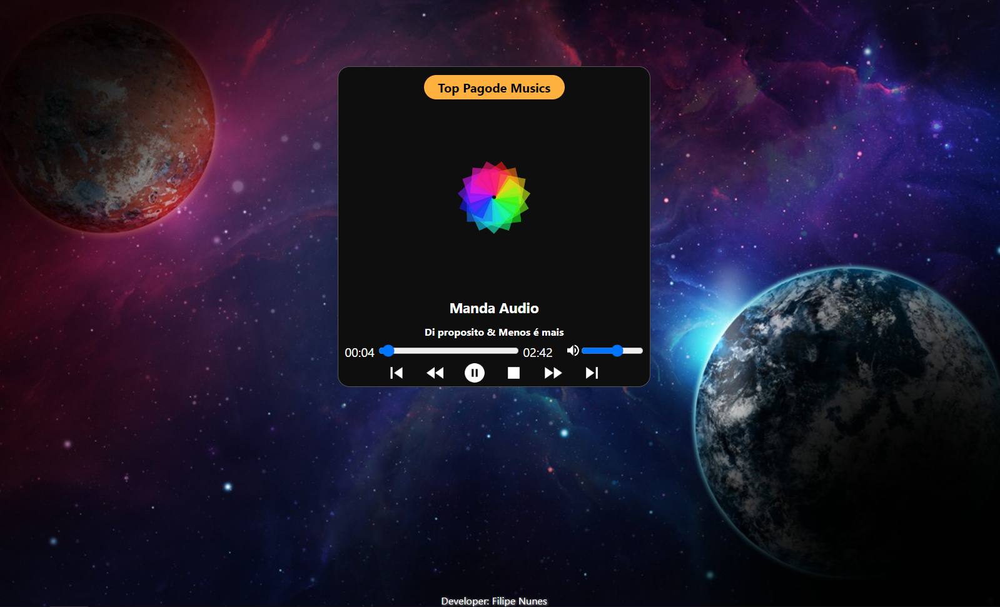

# Player-Music
 Player de Musica feito com as seguintes tecnologias:  
 
 **- Javascript**
 **- Html**
 **- Css**
 
 **Obs: Acesse pelo [GitHub Pages](https://filipe-nunes-silva.github.io/Player-Music/) e veja como ficou meu player de musica.**
 
 
 
 ## Iniciando o projeto:
  - Esse projeto é feito em Html/Css e Javascript puro, então se você baixar basta apenas abrir a pagina index.html e tudo funciona!

 
